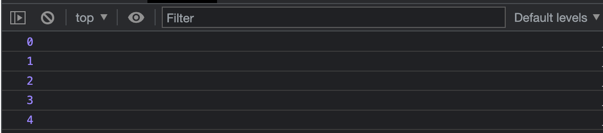
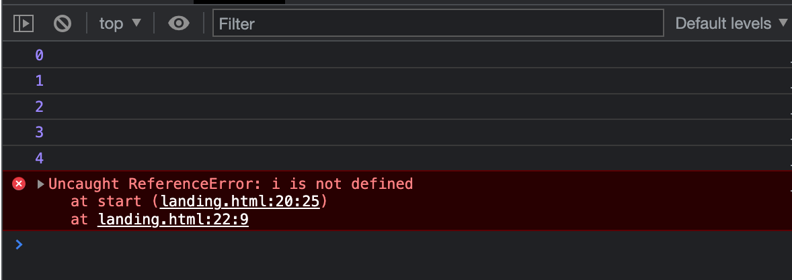
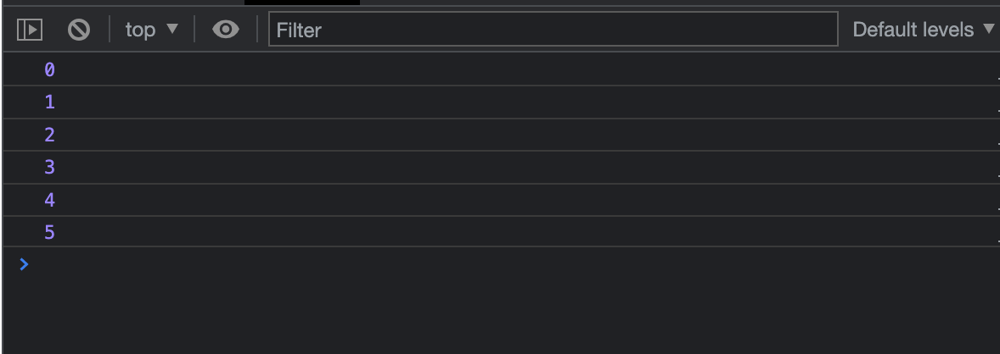

# JS_Cheatsheet

<h1>Variables</h1>

````js 
let message = 'Hello';

alert(message)
````

Note, var can be used to declare variables but it's scope is not limited to the block in which it is designed. See example below:

````js

function start() {
    for (let i =0; i < 5; i++){
        console.log(i);
        }
    }
start ();
````



Now, if we try and access the variable i after the for block, we get an error

````js

function start() {
    for (let i =0; i < 5; i++){
        console.log(i);
        }
    console.log(i);
    }
start ();
````




BUT, if we declare i using var we see that i is still accessabile outside of the for block:

````js

function start() {
    for (var i =0; i < 5; i++){
        console.log(i);
        }
    console.log(i);
    }
start ();
````



<h1> Variable Naming </h1>

<p>There are two limitations on variable names in JavaScript:</p>

- The name must contain only letters, digits, or the symbols $ and _.
- The first character must not be a digit.

<h2> Common Convention </h2>
- camelCase
- '$' and '-' can be used as var names 

<h1>Constants</h1>
<p>To declare a constant (unchanging) variable, use const instead of let:</p>

````js
const myBirthday = '18.04.1982';
````

<p> Variables declared using const are called “constants”. They cannot be reassigned. An attempt to do so would cause an error: </p>

````js
const myBirthday = '18.04.1982';

myBirthday = '01.01.2001'; // error, can't reassign the constant!
````

<h2>Uppercase constants</h2>
<p>There is a widespread practice to use constants as aliases for difficult-to-remember values that are known prior to execution.</p>

<p>Such constants are named using capital letters and underscores.</p>

<p>For instance, let’s make constants for colors in so-called “web” (hexadecimal) format:</p>

````js
const COLOR_RED = "#F00";
const COLOR_GREEN = "#0F0";
const COLOR_BLUE = "#00F";
const COLOR_ORANGE = "#FF7F00";

// ...when we need to pick a color
let color = COLOR_ORANGE;
alert(color); // #FF7F00
````

<h3>Benefits:</h3>
- COLOR_ORANGE is much easier to remember than "#FF7F00".
- It is much easier to mistype "#FF7F00" than COLOR_ORANGE.
- When reading the code, COLOR_ORANGE is much more meaningful than #FF7F00.

<p>Being a “constant” just means that a variable’s value never changes. But there are constants that are known prior to execution (like a hexadecimal value for red) and there are constants that are calculated in run-time, during the execution, but do not change after their initial assignment.</p>

Example:

````js
const pageLoadTime = /* time taken by a webpage to load */;
````
<p> The value of pageLoadTime is not known prior to the page load, so it’s named normally. But it’s still a constant because it doesn’t change after assignment.</p>

<p>capital-named constants are only used as aliases for “hard-coded” values.</p>


<h1> Arithmetic Operations </h1>

- '+'	Addition
- '-'	Subtraction
- '*'	Multiplication
- **	Exponentiation (ES2016)
- /	Division
- %	Modulus (Remainder)
- ++	Increment
- --	Decrement


<h1> Strings </h1>

<h2> Escaping Strings </h2>

The following will throw an error:

````js
const bigmouth = 'I've got no right to take my place…';
````

So we need to escape the single quote after "I" using a backslash:

````js
const bigmouth = 'I\'ve got no right to take my place…';
````

<h1> Concatenating Strings </h1>

<p> To join together strings in JavaScript you can use a different type of string, called a template literal.</p>

<p>A template literal looks just like a normal string, but instead of using single or double quote marks (' or "), you use backtick characters (`):</p>

````js 
const greeting = `Hello`;
````
<p> This can work just like a normal string, except you can include variables in it, wrapped inside ${ } characters, and the variable's value will be inserted into the result:</p>

````js
const name = "Chris";
const greeting = `Hello, ${name}`;
console.log(greeting); // "Hello, Chris"
````

<p> You can use the same technique to join together two variables: </p>

````js
const one = "Hello, ";
const two = "how are you?";
const joined = `${one}${two}`;
console.log(joined); // "Hello, how are you?"
````


<p>You can also concatenate strings using the + operator:</p>

````js
const greeting = "Hello";
const name = "Chris";
console.log(greeting + ", " + name); // "Hello, Chris"
````

<p>However, template literals usually give you more readable code:</p>

````js
const greeting = "Hello";
const name = "Chris";
console.log(`${greeting}, ${name}`); // "Hello, Chris"
````

<h2> Numbers vs Strings</h2>

````js
const name = "Front ";
const number = 242;
console.log(`${name}${number}`); // "Front 242"
````

<p>If you have a numeric variable that you want to convert to a string but not change otherwise, or a string variable that you want to convert to a number but not change otherwise, you can use the following two constructs:</p>

- The Number() function converts anything passed to it into a number, if it can

````js
const myString = "123";
const myNum = Number(myString);
console.log(typeof myNum);
````

- Conversely, every number has a method called toString() that converts it to the equivalent string. 
````js
const myNum2 = 123;
const myString2 = myNum2.toString();
console.log(typeof myString2);
````

<h2> Including expressions in strings</h2>

<p>You can include JavaScript expressions in template literals, as well as simple variables, and the results will be included in the result:</p>

````js
const song = "Fight the Youth";
const score = 9;
const highestScore = 10;
const output = `I like the song ${song}. I gave it a score of ${
  (score / highestScore) * 100
}%.`;
console.log(output); // "I like the song Fight the Youth. I gave it a score of 90%."
````

<h2> Multiline Strings </h2>

<p>Template literals respect the line breaks in the source code, so you can write strings that span multiple lines like this:</p>

````js
const output = `I like the song.
I gave it a score of 90%.`;
console.log(output);

/*
I like the song.
I gave it a score of 90%.
*/
````

<p> To have the equivalent output using a normal string you'd have to include line break characters (\n) in the string:</p>

````js 
const output = "I like the song.\nI gave it a score of 90%.";
console.log(output);

/*
I like the song.
I gave it a score of 90%.
*/
````

<h2> Common String method in JS </h2>

- String length
- String slice()
- String substring()
- String substr()
- String replace()
- String replaceAll()
- String toUpperCase()
- String toLowerCase()
- String concat()


<h3> String Length </h3>

The length property returns the length of a string:

````js 
let text = "ABCDEFGHIJKLMNOPQRSTUVWXYZ";
let length = text.length;
````

<h3> Extracting String Parts </h3>

<p>There are 3 methods for extracting a part of a string:</p>

- slice(start, end)
- substring(start, end)
- substr(start, length)

<h3>String Slice()</h3>

<p>slice() extracts a part of a string and returns the extracted part in a new string.</p>

<p>The method takes 2 parameters: start position, and end position (end not included).</p>

````js
let text = "Apple, Banana, Kiwi";
let part = text.slice(7, 13);
````
<p>If we printed "part" out, we would be get "Banana"</p>
<p>If you omit the second parameter, the method will slice out the rest of the string:</p>

````js
let text = "Apple, Banana, Kiwi";
let part = text.slice(7);
````
<p> part now is "Banana, Kiwi"</p>

<p> If a parameter is negative, the position is counted from the end of the string:</p>

````js
let text = "Apple, Banana, Kiwi";
let part = text.slice(-12);
console.log(part)
````
<p> part is now "Banana, Kiwi"</p>

<p>This example slices out a portion of a string from position -12 to position -6:</p>

````js
let text = "Apple, Banana, Kiwi";
let part = text.slice(-12, -6);
console.log(part)
````
<p>part is now "Banana"</p>

<h3>Substring()</h3>
<p>substring() is similar to slice().</p>
<p>The difference is that start and end values less than 0 are treated as 0 in substring().</p>

````js
let str = "Apple, Banana, Kiwi";
let part = str.substring(7, 13);
console.log(part)
````
<p> part is now Banana</p>
<p>If you omit the second parameter, substring() will slice out the rest of the string.</p>

<h3>Substr()</h3>

<p>substr() is similar to slice().</p>

<p>The difference is that the second parameter specifies the length of the extracted part.</p>

````js
let str = "Apple, Banana, Kiwi";
let part = str.substr(7, 6);
console.log(part)
````
<p> part is now Banana</p>

<p>If you omit the second parameter, substr() will slice out the rest of the string.</p>

<p>If the first parameter is negative, the position counts from the end of the string.</p>

````js
let str = "Apple, Banana, Kiwi";
let part = str.substr(-4);
console.log(part)
````
<p> part is now Kiwi</p>

<h3> Replacing String Content</h3>

<p>The replace() method replaces a specified value with another value in a string:</p>

````js
let text = "Please visit Microsoft!";
let newText = text.replace("Microsoft", "W3Schools");
console.log(newText)
````

<p> newText will now read "Please visit W3Schools"</p>

<p><strong>Note</strong></p>

- The replace() method does not change the string it is called on.

- The replace() method returns a new string.
 
- The replace() method replaces only the first match
 
- If you want to replace all matches, use a regular expression with the /g flag set. See examples below.

- By default, replace() is case sensitive

<p>To replace case insensitive, use a regular expression with an /i flag (insensitive):</p>

````js
let text = "Please visit Microsoft!";
let newText = text.replace(/MICROSOFT/i, "W3Schools");
console.log(newText)
````

<p>To replace all matches, use a regular expression with a /g flag (global match):</p>

````js
let text = "Please visit Microsoft and Microsoft!";
let newText = text.replace(/Microsoft/g, "W3Schools");
console.log(newText)
````

<p> newText will now read "Please visit W3Schools and W3Schools!"</p>

<h3> ReplaceAll()</h3>

<p>In 2021, JavaScript introduced the string method replaceAll():</p>

````js
text = text.replaceAll("Cats","Dogs");
text = text.replaceAll("cats","dogs");
console.long(text)
````
<p> Text prints "cats, dogs"</p>

<p> The replaceAll() method allows you to specify a regular expression instead of a string to be replaced.</p>

<p> If the parameter is a regular expression, the global flag (g) must be set set, otherwise a TypeError is thrown.</p>

````js
text = text.replaceAll(/Cats/g,"Dogs");
text = text.replaceAll(/cats/g,"dogs");
````

<p> replaceAll() is an ES2021 feature.</p>
<p> replaceAll() does not work in Internet Explorer.</p>

<h2> Converting to Upper and to Lower Case </h2>

- A string is converted to upper case with toUpperCase():
- A string is converted to lower case with toLowerCase():

````js
let text1 = "Hello World!";
let text2 = text1.toUpperCase();
console.log(text2)
````
<p> text2 prints "HELLO WORLD!"</p>

```js
let text1 = "Hello World!";       // String
let text2 = text1.toLowerCase();  // text2 is text1 converted to lower
console.log(text2)
````
<p> text2 prints "hello world!"</p>

<h2> String Concat()</h2>

<p> concat() joins two or more strings:</p>

````js 
let text1 = "Hello";
let text2 = "World";
let text3 = text1.concat(" ", text2);
console.log(text3)
````
<p> text3 prints "Hello World"</p>

<p> The concat() method can be used instead of the plus operator. These two lines do the same:</p>


````js
text = "Hello" + " " + "World!";
text = "Hello".concat(" ", "World!");
````

- All string methods return a new string. They don't modify the original string 

- Strings are immutable: Strings cannot be changed, only replaced.

<h2> String trim()</h2>

<p>The trim() method removes whitespace from both sides of a string:</p>

````js
let text1 = "      Hello World!      ";
let text2 = text1.trim();
console.log(text2)
````
<p> text2 prints "Hello World!"</p>

<h2> String trimStart()</h2>

<p>The trimStart() method works like trim(), but removes whitespace only from the start of a string.</p>


````js
let text1 = "     Hello World!     ";
let text2 = text1.trimStart();
console.log(text2)
````

<p> text2 prints "Hello World!     "</p>

<h2> String trimEnd()</h2>

<p>The trimEnd() method works like trim(), but removes whitespace only from the end of a string.</p>

````js
let text1 = "     Hello World!     ";
let text2 = text1.trimEnd();
````

<h2> String padStart()</h2>

<p>The padStart() method pads a string from the start.</p>

<p> It pads a string with another string (multiple times) until it reaches a given length.</p>

````js
let text = "5";
let padded = text.padStart(4,"0");
console.log(padded)
````

<p>padded now prints "0005"</p>

- The padStart() method is a string method.
- To pad a number, convert the number to a string first.

````js
let numb = 5;
let text = numb.toString();
let padded = text.padStart(4,"0");
````
<h2> String padEnd()</h2>

<p> The padEnd() method pads a string from the end. It pads a string with another string (multiple times) until it reaches a given length.</p>

````js

let text = "5";
let padded = text.padEnd(4,"0");
console.log(padded)
````

<p> padded now prints out 5000</p>


<h2> Extracting String Characters </h2>

- charAt(position)
- charCodeAt(position)
- Property access [ ]

<h3> String charAt</h3>

<p>The charAt() method returns the character at a specified index (position) in a string:</p>

````js

let text = "HELLO WORLD";
let char = text.charAt(0);
console.log(char)
````

<p> char now prints out "H"</p>

<h3> String charCodeAt()</h3>
<p> The charCodeAt() method returns the unicode of the character at a specified index in a string:</p>

````js
let text = "HELLO WORLD";
let char = text.charCodeAt(0);
console.log(char)
````

<p> char now prints out "72"</p>

<h3> Property Access</h3>

<p> allows property access [ ] on strings:</p>

````js
let text = "HELLO WORLD";
let char = text[0];
console.log(char)
````

<p> chat now prints out "H"</p>

<p><strong>note</strong></p>

<p> Property access might be a little unpredictable:</p>
- It makes strings look like arrays (but they are not).
- If no character is found, [ ] returns undefined, while charAt() returns an empty string.
- It is read only. str[0] = "A" gives no error (but does not work!).

<h2> Converting a string to an array</h2>
<p>If you want to work with a string as an array, you can convert it to an array.</p>


<h2>String split()</h2>

<p>A string can be converted to an array with the split() method:</p>


````js

text.split(",")    // Split on commas
text.split(" ")    // Split on spaces
text.split("|")    // Split on pipe
````
<p>f the separator is omitted, the returned array will contain the whole string in index [0].</p>

<p>If the separator is "", the returned array will be an array of single characters:</p>


